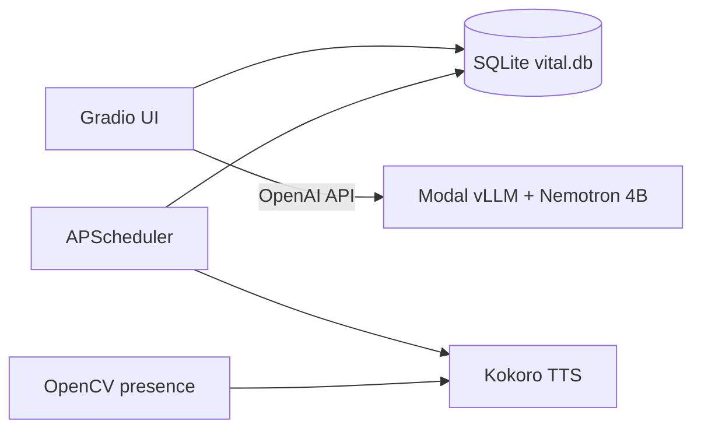
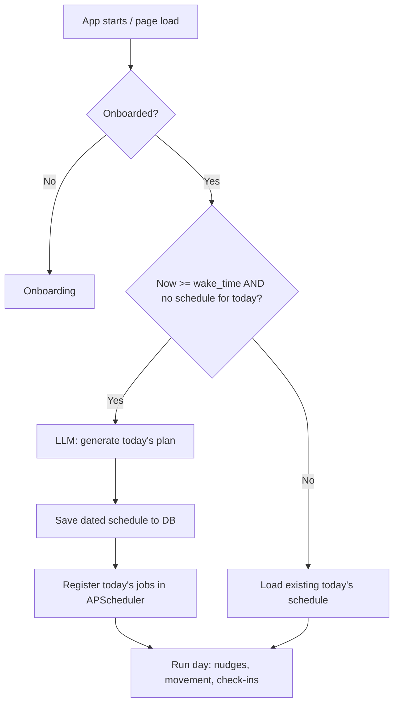

# Vitál

**Personal wellness that lives with your workday.**

**Vitál** is an ambient, local-first personal wellness companion that runs on a user's laptop. It is a background system that knows the user. It interviews you once, builds a personal plan in the localDB, schedules hydration and movement reminders, speaks optional voice nudges, and coaches you with a small LLM that can read and write your logs.

It is designed for anyone who spends long hours at a computer and wants to live more intentionally — eating better, moving more, taking medication consistently, and managing their energy. It is especially valuable for people managing health conditions.

**The core insight:** Existing wellness tracker requires hardware. Vitál is the software equivalent — a wellness operating system that runs on the machine you already use.

**What makes it different:**
- All user data (profile, logs, conversations) is stored locally in SQLite. Nothing is persisted off-device.
- The system is fully dynamic: onboarding interviews the user, the LLM designs their personal plan, and all daily behaviour is driven by what was saved to the local database.
- It speaks to the user out loud via local TTS.
- It watches for desk presence via webcam and responds accordingly.

- **Live demo (Hugging Face Space):** [build-small-hackathon/Vital](https://huggingface.co/spaces/build-small-hackathon/Vital)

[](https://www.youtube.com/watch?v=clf9z7MHT-c)

## What Vitál does

| For everyone | Local app only |
|---|---|
| Conversational onboarding → personalised plan | Desktop notifications (plyer) |
| Daily schedule (meals, water, exercise) | Kokoro TTS voice reminders |
| Coach tab with tool calling | Webcam desk-break detection (OpenCV) |
| Food, water, exercise, medication logging | Morning spoken greeting |
| Weekly report | APScheduler background jobs |

**Privacy:** Profile, logs, plans, and conversations stay in **`data/vital.db`** on your machine. The LLM receives only the prompt context for each call (profile summary, today's logs, schedule). v1 uses a **Modal-hosted** Nemotron endpoint; v2 direction is fully on-device inference.

---

## Architecture



**LLM pipelines** (each uses JSON schema + Python validation + fallbacks):

| Pipeline | Purpose |
|---|---|
| Onboarding Call 1 | ≤3 adaptive follow-up questions |
| Onboarding Call 2 | Full wellness plan (jobs, check-in schema, frameworks) |
| Daily schedule | Timed hydration / meals / exercise for today |
| Coach | Tool loop → structured reply; writes logs when asked |
| Morning briefing | Short daily narrative (cached) |
| Weekly report | End-of-week coaching narrative |

**Model:** [NVIDIA Nemotron 3 Nano 4B BF16](https://huggingface.co/nvidia/NVIDIA-Nemotron-3-Nano-4B-BF16) (~4B) on **Modal** via **vLLM** (OpenAI-compatible `/v1`).

### Application Flow



## Requirements

### Everyone

- **Python 3.12+**
- **Modal account** (or another OpenAI-compatible endpoint) for the LLM
- **HuggingFace token** with access to Nemotron weights (for Modal deploy)

### Local full experience (optional hardware)

- **Speakers** — Kokoro TTS
- **Webcam** — desk-break presence (disabled automatically if missing)
- **Windows** — `install.bat` / `Start_Vital.bat` (macOS/Linux: use `uv` commands below)

### Disk / RAM

- ~1 GB free (app + Kokoro voice cache)
- 8 GB+ RAM recommended

---

## Quick start (Windows)

1. Install [Python 3.12+](https://www.python.org/downloads/) and **Add python.exe to PATH**.
2. Clone this repo:
   ```bat
   git clone https://github.com/eddyejembi/vital.git
   cd vital
   ```
3. Create a `.env` file and add to the root folder (see below).
4. Run **`install.bat`** (installs `uv`, creates `.venv`, copies `.env.example` → `.env` if needed).
5. When prompted, open `.env` and set your LLM URL and model id (see [Configure the LLM](#configure-the-llm)).
6. Run **`Start_Vital.bat`** each day. Leave the window open while you use the app.
7. Complete **onboarding** in the browser (`http://127.0.0.1:7860`).

You can stop Vital with `CTRL C` on the console window.

---

## Quick start (developers)

```bash
git clone https://github.com/eddyejembi/vital.git
cd vital

cp .env.example .env   # edit VITAL_LLM_BASE_URL and VITAL_MODEL_ID

uv sync
uv run python app.py   # http://127.0.0.1:7860
```

Run tests:

```bash
uv run python -m pytest tests/ -q
```

---

## Configure the LLM

Vitál talks to an **OpenAI-compatible** chat API. The reference setup uses **Modal + vLLM**.

### 1. Deploy Nemotron on Modal (one-time)

```bash
pip install modal
modal secret create huggingface HF_TOKEN=hf_xxxx
modal deploy infra/vllm_serve.py
```

Copy the printed URL into `.env`:

```env
VITAL_LLM_BASE_URL=https://<workspace>--vital-nemotron-serve.modal.run/v1
VITAL_MODEL_ID=nemotron3-nano-4B-BF16
VITAL_LLM_API_KEY=vital-local
```

See `infra/vllm_serve.py` for GPU (A10G), tool calling, and context limits.

### 2. Token budget (important)

Modal serves Nemotron with **8192** context. Input + output must fit:

```env
VITAL_MAX_TOKENS=4096
VITAL_CONTEXT_LIMIT=8192
VITAL_DAILY_SCHEDULE_MAX_TOKENS=4096
```

Do **not** set `VITAL_MAX_TOKENS=8192` unless you increase `MAX_MODEL_LEN` on Modal.

### 3. Local-only flags

```env
DEMO_MODE=false
VITAL_SERVER_HOST=127.0.0.1
VITAL_SERVER_PORT=7860
VITAL_LAUNCH_IN_BROWSER=true
```


## Project layout

```
vital/
├── app.py                 # Local entry point
├── space_app.py           # Hugging Face Space entry point
├── install.bat            # Windows one-time setup
├── Start_Vital.bat        # Windows daily launcher
├── infra/vllm_serve.py    # Modal Nemotron deploy
├── core/                  # Scheduler, TTS, presence, notifications, startup
├── llm/                   # Client, tools, onboarding, daily plan, coach
├── db/                    # SQLite schema and queries
├── ui/                    # Gradio tabs
├── vital_types/           # Shared types
├── scripts/               # Manual test / report scripts
├── tests/
└── data/                  # vital.db (created at runtime, gitignored)
```

---

## Contributing

Contributions are welcome — issues, docs, tests, and pull requests.

### Suggested workflow

1. **Fork** [github.com/eddyejembi/vital](https://github.com/eddyejembi/vital) on your GitHub account.
2. **Clone** your fork:
   ```bash
   git clone https://github.com/YOUR_USERNAME/vital.git
   cd vital
   ```
3. **Create a branch** from `main`:
   ```bash
   git checkout -b fix/short-description
   ```
4. **Make changes**, run tests:
   ```bash
   uv run python -m pytest tests/ -q
   ```
5. **Commit** with a clear message (what and why).
6. **Push** and open a **Pull Request** against `eddyejembi/vital` → `main`.
7. Describe what you changed and how you tested it.

### Code guidelines

- LLM outputs: use defined JSON schemas and validation (see `llm/onboarding.py`, `llm/daily_schedule.py`, `llm/client.py`).
- `DEMO_MODE` guards for hardware (TTS, camera, desktop notifications).
- Do not commit `.env`, `data/vital.db`, or secrets.

### Report bugs

Open a [GitHub Issue](https://github.com/eddyejembi/vital/issues) with:

- OS and Python version
- Steps to reproduce
- Relevant log lines (no API keys)


## Scripts

| Script | Purpose |
|---|---|
| `scripts/generate_weekly_report.py` | Force-generate weekly report (`--seed`, `--fallback-only`) |
| `scripts/eval_llm.py` | Live LLM / tool smoke against Modal |
| `scripts/clear_daily_schedules.py` | Clear today's scheduler jobs |

---

## Built with

Gradio 6 · SQLite · APScheduler · Modal · vLLM · NVIDIA Nemotron 3 Nano 4B · Kokoro TTS · OpenCV · plyer · OpenAI Python SDK

---

## Author

**Eddy Ejembi** — [GitHub](https://github.com/eddyejembi)

Built for the [Build Small Hackathon](https://huggingface.co/build-small-hackathon); continued as an open source local-first wellness project.

## License

This project is licensed under the MIT License - see the [LICENSE](LICENSE) file for details.
