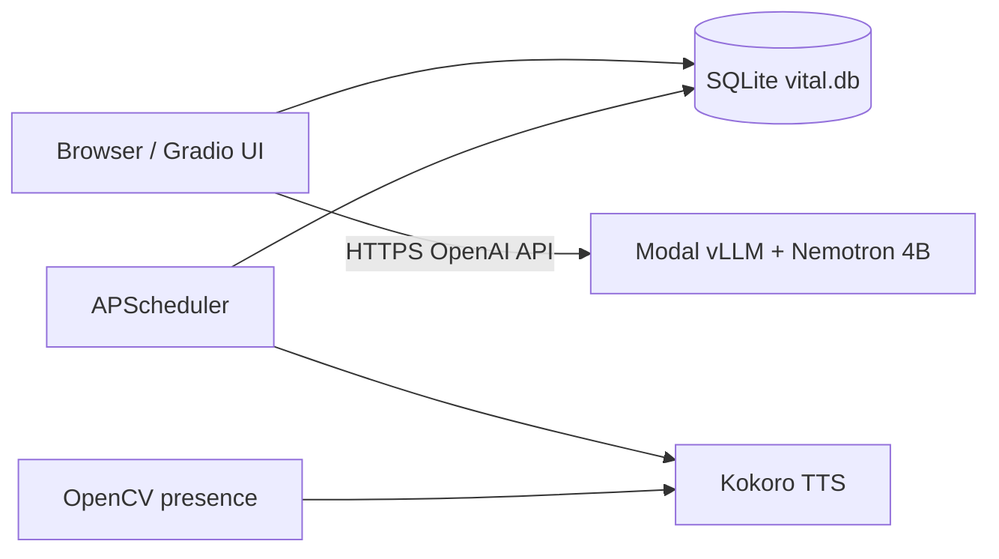

# Vitál

### _Your laptop already knows your schedule. Vitál makes it care about your health._

Vitál is an **ambient wellness companion for people who live at their laptops**. It plans the day, nudges the user at the right time, logs wellness actions, and coaches from local history instead of acting like a generic chatbot.

**If you remove Nemotron, Vitál loses onboarding, daily planning, coach writes, briefings, and weekly reports — it is not a CRUD app with a chatbox.**

For the hackathon Space, judges land directly on **Amara's pre-seeded profile**. No onboarding is required during judging. The full local version also includes first-run onboarding, desktop notifications, local voice reminders, and optional webcam-based desk-break detection.

[](https://www.youtube.com/watch?v=clf9z7MHT-c)
**Social post:** coming before final submission

---

## TL;DR for judges

| | |
|---|---|
| **Track** | **Backyard AI** — built around Amara, a remote software engineer in Lagos who wants steadier energy, better meals, light movement, and medication consistency |
| **Small-model bet** | **NVIDIA Nemotron 3 Nano 4B BF16** (~4B params) on **Modal** via vLLM — under the 32B cap; workflow + schemas + tools do the heavy lifting |
| **Sponsor alignment** | **Nemotron** (primary reasoning model) · **Modal** (GPU inference, scale-to-zero) |
| **Hosted demo path** | Open Space → Amara's dashboard → Coach read/write → weekly report |
| **Agentic pieces** | Onboarding (2 calls), daily scheduler, coach tool loop, morning briefing, weekly report |
| **Guardrails** | JSON schemas per pipeline, Python validation, retries, template fallbacks |
| **Local-first posture** | Profile, plans, logs, schedules, and reports persist in SQLite on device |
| **Space mode** | `DEMO_MODE=true` — TTS, webcam presence, and desktop notifications disabled (no local hardware on HF) |
| **Full local mode** | `install.bat` / `Start_Vital.bat` — Kokoro TTS, plyer notifications, OpenCV desk breaks, APScheduler |

---

## What to try first

1. Open the Space. You should land on **Amara's Home dashboard**, already onboarded.
2. Check **Home** for today's briefing, medication checklist, metrics, and generated schedule.
3. Open **Nutrition** and **Movement** to see today's hydration, meal, and exercise plan.
4. In **Coach**, try: _"How am I doing on water today?"_
5. Then try a write action: _"Log lunch: moi moi and orange"_.
6. Return to **Nutrition** and refresh. The food log should now include the meal.
7. Open **Report** and generate a weekly report if one is not already present.

Coach is not answering from vibes. It calls tools, reads Amara's SQLite-backed state, and writes new logs when asked.

---

## Why this is Backyard AI

Most wellness trackers need hardware or cloud accounts. Vitál is a **wellness OS for the machine you already have** — built for the messy reality of desk work skipped lunches, long sitting sessions, and it runs on the machine the user already has.

- Starts from a **personal profile**, not a generic system prompt.
- Generates a **daily schedule** from goals, medications, local foods, sleep/wake times, prior logs, and weather.
- **Nudges** with desktop and voice reminders in local mode.
- **Reads** today's actual logs before advising.
- **Writes** back when the user logs food, water, exercise, or medication.

Amara is the demo profile; local onboarding generates a different plan for whoever runs it — same codebase.

---

## Why Nemotron 3 Nano 4B

| | |
|---|---|
| **Size** | ~4B parameters — comfortably under the hackathon 32B cap |
| **Tool calling** | Coach uses OpenAI-style tools (`log_food`, `get_todays_logs`, etc.) via vLLM `--enable-auto-tool-choice` |
| **Structured output** | Separate JSON schemas for onboarding, daily plan, coach reply, and weekly report — not one free-form chat |
| **Reasoning format** | Nemotron's reasoning parser plugin runs on the Modal server (`nano_v3_reasoning_parser.py`) |
| **Context budget** | 8192-token window on Modal; app uses `VITAL_MAX_TOKENS=4096` so prompts + completions fit without truncation |

The bet: a **small model pushed hard** with schemas, validation, tool loops, and Python fallbacks — not a bigger model with a single prompt.

---

## Why Modal

| | |
|---|---|
| **GPU when needed** | Nemotron runs on Modal **A10G** with vLLM |
| **Scale to zero** | `scaledown_window=15min` — no 24/7 GPU bill for a personal wellness app |
| **OpenAI-compatible API** | One `VITAL_LLM_BASE_URL` for local dev, Windows users, and the HF Space |
| **Separation of concerns** | Space = Gradio UI + SQLite demo; Modal = inference only |
| **Cached weights** | HF + vLLM volumes on Modal avoid cold-download on every deploy |

Vitál's **data stays local** (SQLite). Modal hosts only the **reasoning brain** for this v1 hackathon build.

---

## Architecture



**HF Space (demo):** Browser → Gradio → SQLite → Modal (no TTS / camera / OS notifications).

**Local app (full):** Same stack plus Kokoro voice, plyer desktop alerts, and webcam desk-break detection.

---

## LLM pipelines and guardrails

| Pipeline | What goes in | What comes out | Guardrails |
|---|---|---|---|
| **Onboarding Call 1** | Profile | ≤3 follow-up questions | `FOLLOW_UP_JSON_SCHEMA`, retry once |
| **Onboarding Call 2** | Profile + answers | Full wellness plan (jobs, schema, frameworks) | `ONBOARDING_PLAN_JSON_SCHEMA`, validation |
| **Daily schedule** | Profile + logs + prior-week meals + weather | Timed hydration / meal / exercise jobs | Schema + template fallback + repair pass |
| **Coach** | Chat history + DB context | Tool loop → final `COACH_REPLY_JSON_SCHEMA` | Tool arg validation, food-log nudge + Python fallback |
| **Morning briefing** | Profile + today's plan | Short spoken narrative | Cached in DB per day |
| **Weekly report** | Week stats + logs | Narrative + highlights + focus | Schema + template fallback |

**Coach tools (examples):** `get_todays_logs`, `get_todays_schedule`, `get_medications_today`, `log_food`, `log_water`, `log_exercise`, `get_weekly_summary`, `write_weekly_report`.

---

## How it works (runtime layers)

| Layer | What happens |
|---|---|
| **UI** | Gradio 6 — Home, Nutrition, Movement, Coach, Report, Settings |
| **Brain** | Nemotron 3 Nano 4B on Modal (vLLM, OpenAI `/v1/chat/completions`) |
| **State** | SQLite — profile, logs, food/exercise, daily plans, scheduler jobs, reports |
| **Scheduler** | APScheduler loads jobs from DB; fires notifications + optional TTS |
| **Local hardware** | Kokoro TTS, plyer notifications, OpenCV presence (local only) |
| **Fallbacks** | Template daily plan, template weekly report, copy-yesterday plan |

---

## Modal deploy (reproduce the LLM endpoint)

```bash
modal secret create huggingface HF_TOKEN=hf_xxxx
modal deploy infra/vllm_serve.py
```

Copy the printed URL into `.env`:

```bash
VITAL_LLM_BASE_URL=https://<workspace>--vital-nemotron-serve.modal.run/v1
VITAL_MODEL_ID=nemotron3-nano-4B-BF16
```

Server flags that matter for Vitál: `--enable-auto-tool-choice`, Nemotron reasoning parser, `max-model-len=8192`, A10G GPU. See `infra/vllm_serve.py`.

---

## Hosted Space vs local app

The Hugging Face Space is a judge-friendly demo with a **pre-seeded SQLite profile** so the first screen is already useful. Hardware-specific features are disabled:

- no local speech output (Kokoro runs on the user's machine, not Modal)
- no webcam presence checks
- no desktop push notifications

The local app is the full experience: voice reminders, native notifications, and desk-break detection without storing or transmitting webcam frames.

---

## Privacy posture

Vitál is **local-first, not fully offline**.

Persistent wellness data lives in SQLite on the machine running the app. Each LLM call receives only the context needed for that action (profile summary, today's logs, schedule, weather). v2 direction: fully on-device inference; v1 uses Modal-hosted Nemotron for reliability.

---

## Local setup

```bash
git clone https://github.com/eddyejembi/vital
cd vital
cp .env.example .env   # set VITAL_LLM_BASE_URL and VITAL_MODEL_ID
uv sync
uv run python app.py   # -> http://127.0.0.1:7860
```

On Windows:

```bat
install.bat
Start_Vital.bat
```

Recommended `.env` tuning (8192 context model on Modal):

```bash
VITAL_LLM_BASE_URL=https://<your-modal-endpoint>/v1
VITAL_MODEL_ID=nemotron3-nano-4B-BF16
VITAL_MAX_TOKENS=4096
VITAL_CONTEXT_LIMIT=8192
VITAL_DAILY_SCHEDULE_MAX_TOKENS=4096
DEMO_MODE=false
```


---

## Built with

- Gradio 6 · SQLite · APScheduler
- **Modal** · **vLLM** · **NVIDIA Nemotron 3 Nano 4B BF16**
- Kokoro TTS · OpenCV · plyer (local only)

**GitHub:** https://github.com/eddyejembi/vital

_Built for the [Build Small Hackathon](https://huggingface.co/build-small-hackathon) (Gradio × Hugging Face) — Backyard AI track._
